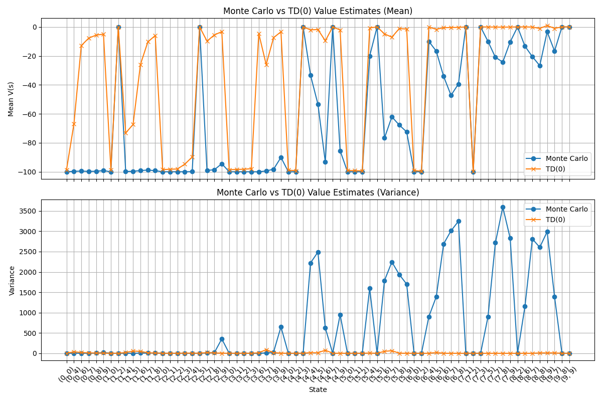
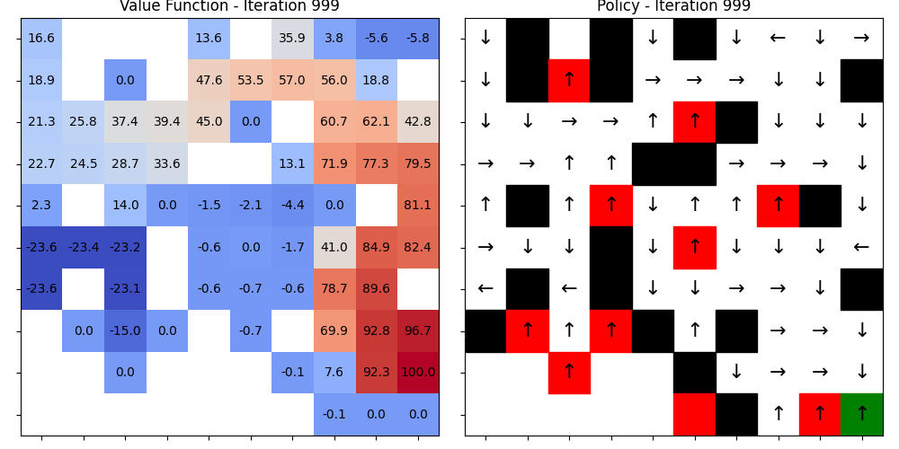
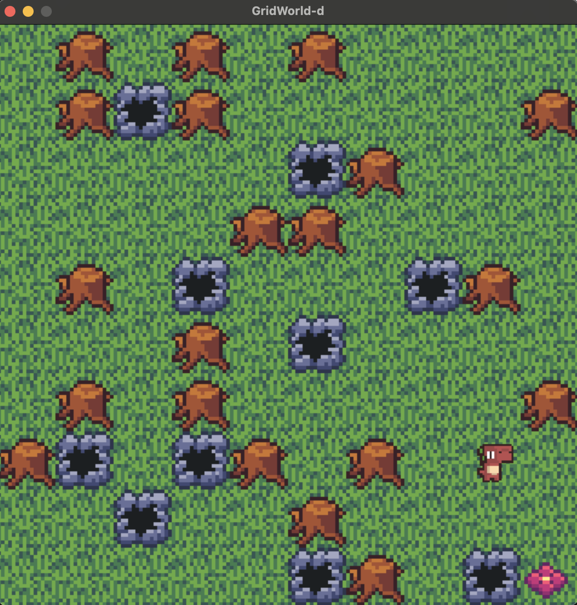

## Lab 2. Model-Free Prediction and Control
This provides an introduction to model-free prediction and control algorithms tested on a discrete GridWorld environment.
Implemented algorithms include:

- **Model-Free Prediction: Monte-Carlo, TD(0)**
- **Model-Free Control: SARSA, Q-Learning**

---

### GridWorld Environment

The GridWorld environment is same as [Lab1](../Lab1_DP/README.md).


### Training

To train an RL agent, run the `train.py` script with the desired algorithm and optional arguments.
```bash
python train.py --algo {algorithm} [--map_size SIZE] [--save_name SAVE_NAME]
```
**Arguments**
- --algo (str, required): Choose the learning algorithm (Model-Free Prediction, SARSA, Q-Learning)
	- Options: mf_pred, sarsa, q_learning
- --map_size (int, optional): Width & Height of the GridWorld. Default is 6. (Range should be 5-10)
- --save_name (str): Filename to save the policy and the plots.
- --render (action flag): If specified, render the agent's behavior during training. (only for SARSA and Q-Learning)

**Parameter Arguments**
You can adjust the parameters for training with additional arguments
- --every_visit (action flag): Add this flag to run every-visit MC. (only for mf_pred)
- --use_incr_mean (action flag): Add this flag to use incremental mean in computing MC. (only for mf_pred)
- --runs (int) Number of times to run MC/TD(0) for model-free prediction experiment. Default is 30 (only for mf_pred)
- --episodes (int) Number of episodes. Default is 1000
- --gamma (float): Gamma values. Default is 0.95
- --alpha (float): Gamma values. Default is 0.1

**Save**
For **model-free prediction** experiment, the mean and variance plot for Monte-Carlo and TD(0) would be saved in
`outputs/mf_pred_{args.save_name}/bias_variance_comparison.png`.

For **SARSA and Q-Learning**, the trained policy will be saved as `checkpoints/policy_{args.algo}_{args.save_name}.pkl`.

The visualization of the value function and policy for each iteration are saved in `outputs/{args.algo}_{args.save_name}/` folder. In this visualization, 
  - Red: Trap
  - Black: Wall
  - Green: Goal 
  - White: Normal
---

### Rendering a Trained Policy
For SARSA and Q-Learning, you can visualize a learned policy using the `render.py` script:
```bash
python render.py --policy {path_to_policy.pkl} [--map_size SIZE] [--random]
```
**Arguments**
- --policy (str, optional): Path to a .pkl policy file. (should provide as `policy_{algo}_{save_name}.pkl` format) If omitted, agent would act randomly.
- --map_size (int, optional): Grid size (default 6). Range should be 5-10.
- --random (flag): Use a randomly generated map instead of a fixed one.

This will render the agent's behavior following the trained policy in the GridWorld environment.

---

### Example Script
#### Model-Free Prediction
```bash
# training
python train.py --algo mf_pred --map_size 10 --save_name test 
```

#### SARSA
```bash
# training
python train.py --algo sarsa --map_size 10  --save_name test # add --render to see how the agents learns during the training process
# rendering
python render.py --policy policy_sarsa_test.pkl --map_size 6
```

#### Q-Learning
```bash
# training
python train.py --algo q_learning --map_size 10  --save_name test # add --render to see how the agents learns during the training process
# rendering
python render.py --policy policy_q_learning_test.pkl --map_size 10
```

For model-free prediction, the plot would be saved as `/outputs/mf_pred_{args.save_name}/bias_variance_comparison.png` as like the following example:



After running the training script for SARSA and Q-Learning, plot for value function and policy would be saved in `/outputs/mf_pred_{args.save_name}/iteration_{iteration_num}.png` as like the following example:



After running the rendering script for SARSA and Q-Learning, a window with the following visualization would appear:

